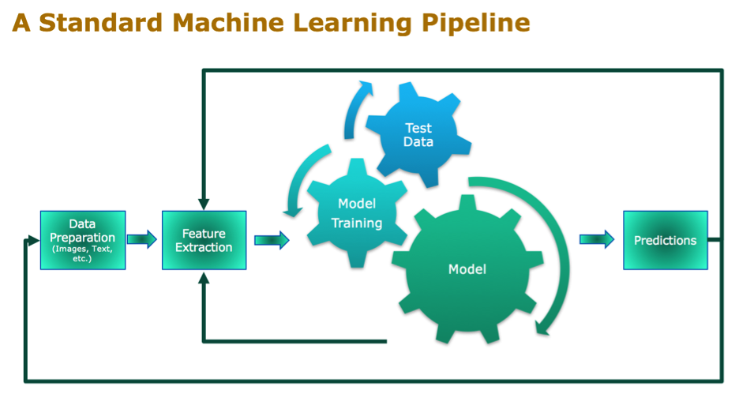
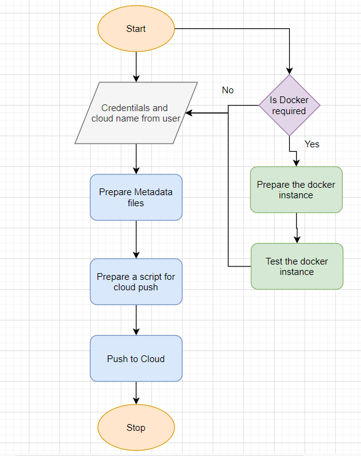

<h1>Workflow Data Ingestion and File Conversion</h1>

**Data Ingestion:** 

**Data ingestion** is the transportation of data from assorted sources to a storage medium where it can be accessed, used, and analyzed by an organization.

The destination is typically a data warehouse, data mart, database, or a document store. 

Data Connector Utils | File Conversion Utils |
------------ | ------------- | 
[Microsoft Access](https://help.tableau.com/current/pro/desktop/en-us/examples_access.htm) | CSV & text files, PDF
[Spatial File]()| JSON
[Statistical File]()|HTML
[Tableau Server or Tableau Online]()|Excel files
[Actian Matrix]()|openDocument Spreadsheets
[Actian Vectorwise]()|Binary Excel (.xlsb) files
[Alibaba AnalyticDB for MySQL]()|Clipboard
[Alibaba Data Lake Analytics]()|Pickling
[Alibaba MaxCompute]()|msgpack
[Amazon Athena]()|HDF5 (PyTables)
[Amazon Aurora for MySQL]()|Feather
[Amazon EMR Hadoop Hive]()|Parquet
[Amazon Redshift]()|ORC
[Anaplan]()|Google BigQuery
[Apache Drill]()|Stata format
[Aster Database]()|SAS formats
[Azure SQL Synapse Analytics]()|SPSS formats
[Box]()|Other file formats
[Cloudera Hadoop]()|Performance considerations
[Databricks]()|
[Denodo]()|
[Dropbo]()|
[Esri ArcGIS Server]()|
[Exasol]()|
[Firebird 3]()|
[Google Ads]()|
[Google Analytics]()|
[Google BigQuery]()|
[Google Cloud SQL]()|
[Google Drive]()|
[Google Sheets]()|
[Hortonworks Hadoop Hive]()|
[IBM BigInsights]()|
[IBM DB2]()|
[IBM PDA (Netezza)]()|
[Impala]()|
[Intuit QuickBooks Online]()|
[Kognitio]()|
[Kyvos]()|
[LinkedIn Sales Navigator]()|
[MapR Hadoop Hive]()|
[MariaDB]()|
[arketo]()|
[MarkLogic]()|
[MemSQL]()|
[Microsoft Analysis Services]()|
[Microsoft PowerPivot]()|
[Microsoft SQL Server]()|
[MonetDB]()|
[MongoDB BI Connector]()|
[MySQL]()|
[OData]()|
[OneDrive]()|
[Oracle]()|
[Oracle Eloqua]()|
[Oracle Essbase]()|
[Pivotal Greenplum]()|
[PostgreSQL]()|
[Presto]()|
[Progress OpenEdge]()|
[Qubole Presto]()|
[Salesforce]()|
[Splunk]()|
[SAP HANA]()|
[SAP NetWeaver Business Warehouse]()|
[SAP Sybase ASE]()|
[SAP Sybase IQ]()|
[ServiceNow ITSM]()|
[SharePoint Lists]()|
[Snowflake]()|
[Spark SQL]()|
[Connector Plugin]()|
[Web Data Connector]()|
[Other Databases (JDBC)]()|
[Other Databases (ODBC)]()|

**Phase 2:**

Data Connector Utils | File Conversion Utils |
------------ | ------------- | 
[Spatial File](https://help.tableau.com/current/pro/desktop/en-us/examples_spatial_files.htm)| OpenDocument Spreadsheets
[Statistical File](https://help.tableau.com/current/pro/desktop/en-us/examples_statfile.htm)| 
[Tableau Server or Tableau Online](https://help.tableau.com/current/pro/desktop/en-us/examples_tableauserver.htm)|
[Actian Matrix](https://help.tableau.com/current/pro/desktop/en-us/examples_actianmatrix.htm)|
[Teradata OLAP Connector](https://help.tableau.com/current/pro/desktop/en-us/examples_teradata_olap.htm)|
[TIBCO Data Virtualization](https://help.tableau.com/current/pro/desktop/en-us/examples_ciscoinfoserver.htm)|
[Vertica](https://help.tableau.com/current/pro/desktop/en-us/examples_vertica.htm)|
[Teradata](https://help.tableau.com/current/pro/desktop/en-us/examples_teradata.htm)|

Class Name | DataGetter |  |
------------ | ------------- | -----|
Method Name    |read_data_from_csv    |
| | Method Description |This method will be used to read data from a csv file or a flat file
 | |Input parameter  names |self,file_name, header,names, use_cols, separator 
 | |Input Parameter Description|   file_name: name of the file to be read header: Row number(s) to be used as column names names : array-like, optional List of column names to use. If file contains no header row, then you should explicitly pass ``header=None``. Use_cols:  To load a subset of columns Separator: Delimiter to use 
 | |ouptput    |A pandas Dataframe 
 | |On Exception|  Write the exception in the log file. Raise an exception with the appropriate error message 
Method Name|   read_data_from_json||
| |Method Description  |This method will be used to read data from a json file.
| |Input parameter  names| self,file_name
| |Input Parameter Description |file_name: name of the file to be read
| |ouptput|    A pandas Dataframe
| |On Exception| Write the exception in the log file. Raise an exception with the appropriate error message
Method Name    |read_data_from_html   |
| |Method Description  |This method will be used to read data from an HTML web page Input parameter  names    self,url
| |Input Parameter Description|    url: URL of the HTML page to be read. 
| |ouptput |A pandas Dataframe
| |On Exception    |Write the exception in the log file. Raise an exception with the appropriate error message
Method Name    |read_data_from_excel  |
| |Method Description| This method will be used to read data from an MS Excel File
| |Input parameter  names| self,file_name,sheet_name, header,names, use_cols, separator
| |    Input Parameter Description    |file_name: name of the file to be read sheet_name: Lists of strings/integers are used to request multiple sheets. Specify None to get all sheets. header: Row number(s) to be used as column names names : array-like, optional List of column names to use. If file contains no header row, then you should explicitly pass ``header=None``. Use_cols:  To load a subset of columns Separator: Delimiter to use
| | ouptput    |A pandas Dataframe
| |On Exception    |Write the exception in the log file. Raise an exception with the appropriate error message
Method Name    |Connect_to_sqldb  |
| |Method Description| This method will be used to connect to a SQL Databases
| |Input parameter  names| self,host,port, username, password
   | |Input Parameter Description|    host: the server hostname/IP where the DB server is hosted Port: the port at which the DB Server is running username: The username to connect to the DB server password: The password to connect to the DB server
| |ouptput|    A DB connection object
| |    On Exception   |Write the exception in the log file. Raise an exception with the appropriate error message
Method Name    |read_data_from_sqldb| |
| |Method Description  |This method will be used to read data from SQL Databases
| |Input parameter  names  |self,db_name,host,port, username, password, schema_name,query_string
   | |Input Parameter Description|    db_name: For example, SQL, MySQL, SQLLite etc. host: the server hostname/IP where the DB server is hosted Port: the port at which the DB Server is running username: The username to connect to the DB server password: The password to connect to the DB server schema_name: The name of the DB schema the user wants to connect to. query_string: the query to be executed to load the data
| |ouptput |A Pandas Dataframe
| |    On Exception   |Write the exception in the log file. Raise an exception with the appropriate error message Method Name    read_data_from_mongdb  
| |Method Description| This method will be used to read data from Mongo DB
| |Input parameter  names  |self,host,port, username, password, db_name,collection_name, query_string. Input Parameter Description    |host: the server hostname/IP where the DB server is hosted Port: the port at which the DB Server is running username: The username to connect to the DB server password: The password to connect to the DB server db_name: The name of the database collection_name: The name of the collection the user wants to connect to. query_string: the query to be executed to load the data
   | |output| A Pandas Dataframe
   | |On Exception    |Write the exception in the log file. Raise an exception with the appropriate error message

**Exceptions Scenarios**

|Step  |Exception |Mitigation|
--------|----------|----|
User gives Wrong Data Source|  Give proper error message| Ask the user to re-enter the details
User gives corrupted data |    Give proper error message  

<h2>Data Profiling</h2>

**Data profiling** is the process of reviewing source data, understanding structure, content and interrelationships, and identifying potential for data projects.   

After reading the data, automatically the following details should be shown:
a) The number of rows
b) The number of columns
c) Number of missing values per column and their percentage
d) Total missing values and it’s percentage
e) Number of categorical columns and their list
f) Number of numerical columns and their list
g) Number of duplicate rows
h) Number of columns with zero standard deviation and their list
i) Size occupied in RAM

Method Definition

Class Name |DataProfiler||
---------|--------|-------|
Method Name    |get_data_profile  |
||Method Description|  This method will be used to give various insighst about data.
| |Input parameter  names| self, dataframe
| |Input Parameter Description |dataframe: the inpt data just loaded from source 
| |ouptput |a)    The number of rows 
| | |b)    The number of columns
| | |c)    Number of missing values per column and their percentage
| | |d)    Total missing values and it’s percentage
| | |e)    Number of categorical columns and their list
| | |f)    Number of numerical columns and their list
| | |g)    Number of duplicate rows
| | |h)    Number of columns with zero standard deviation and their list
| | |i)    Size occupied in RAM
| |On Exception    |Write the exception in the log file. Raise an exception with the appropriate error message

<h2>Stats based EDA:</h2>

**MVP**: Minimum Viable Product
Building a minimum viable product is an opportunity to quickly test an idea and see if it works. It doesn't need to be the best solution, it should just be a usable solution. If it is, then we can move on to the development stage and make it work well.
 
**OLS**: Ordinary least squares
The OLS method corresponds to minimizing the sum of square differences between the observed and predicted values.

**VIF**: 
The variance inflation factor (VIF) is the quotient of the variance in a model with multiple terms by the variance of a model with one term alone. It quantifies the severity of multicollinearity in an ordinary least squares regression analysis.
Correlation:
Correlation is a statistical technique that can show whether and how strongly pairs of variables are related

**Phase1:**

**Anova test:**
An ANOVA test is a way to find out if survey or experiment results are significant. In other words, they help you to figure out if you need to reject the null hypothesis or accept the alternate hypothesis. Basically, you're testing groups to see if there's a difference between them.

**Chi-square test** 
Pearson's chi-square test is used to determine whether there is a statistically significant difference between the expected frequencies and the observed frequencies in one or more categories of a contingency table.

**Z-test** 
A z-test is a statistical test to determine whether two population means are different when the variances are known and the sample size is large. It can be used to test hypotheses in which the z-test follows a normal distribution. A z-statistic, or z-score, is a number representing the result from the z-test.

**T test** 
The t test is one type of inferential statistics. It is used to determine whether there is a significant difference between the means of two groups. With all inferential statistics, we assume the dependent variable fits a normal distribution

**Weight of evidence** 
The weight of evidence tells the predictive power of an independent variable in relation to the dependent variable.

**F-test** 
An F-test is any statistical test in which the test statistic has an F-distribution under the null hypothesis. It is most often used when comparing statistical models that have been fitted to a data set, in order to identify the model that best fits the population from which the data were sampled.
         

Technical solution design

 
**Exceptions Scenarios Module Wise**

Step   |Exception |Mitigation|
-----|-----|------|
Column has mixed values(Integer & number)  |Give proper error message |Ask the user to correct the data.
Not all values are numbers |   Handle Internally  |Convert categorical to numerical values

**Phase 2:**

**Seasonality:**
Seasonality is a characteristic of a time series in which the data experiences regular and predictable changes that recur every calendar year. Any predictable fluctuation or pattern that recurs or repeats over a one-year period is said to be seasonal.

**Stationary Data:**
A common assumption in many time series techniques is that the data are stationary. A stationary process has the property that the mean, variance and autocorrelation structure do not change over time

<h2>4    Graph-Based EDA</h2>

Create the following graphs:
MVP:
Correlation Heatmaps
Check for balance/imbalance
Phase1:
Count plots
Boxplot for outliers
Piecharts for categories
Geographical plots for scenarios
Line charts for  trends
Barplots
Area Charts
KDE Plots
Stacked charts
Scatterplot

**Phase 2:**
Word maps
PACF
ACF
Add Custom controls sliders etc

Graphical EDA:

Class Name |DataVisualization ||
------|---------|----| 
Method Name    |read_data_from_csv    |
| |Method Description| This method will be used to read data from a csv file or a flat file
| |Input parameter  names| self,file_name, header,names, use_cols, separator
| |Input Parameter Description|    file_name: name of the file to be read header: Row number(s) to be used as column names names : array-like, optional List of column names to use. If file contains no header row, then you should explicitly pass ``header=None``. Use_cols:  To load a subset of columns Separator: Delimiter to use
| |    output |A pandas Dataframe
| |On Exception|   Write the exception in the log file. Raise an exception with the appropriate error message

**Exceptions Scenarios Module Wise**

Step   |Exception|    Mitigation|
|------|------|---------|
Wrong input to the methods |   Handle Internally| Code should never give a wrong input

**Phase 2:**
A time series can have components like trend, seasonality, cyclic and residual. ACF considers all these components while finding correlations hence it's a 'complete auto-correlation plot'. PACF is a partial auto-correlation function.

More about sliders: https://plotly.com/python/sliders/

<h2>5.   Library Based Utils</h2>

Technical solution design
Exceptions Scenarios Module Wise

<h2>6.    Data Transformers( Pre-processing steps)</h2>

**MVP:**
Null value handling
Categorical to numerical
Imbalanced data set handling
Handling columns with std deviation zero or below a threshold
Normalisation
PCA

**Phase1:**
Outlier detection
Data Scaling/ Normalisation
Feature Selection: https://scikit-learn.org/stable/auto_examples/index.html#feature-selection

Class Name |DataPreprocessor| |
----|-------|--------|    
|Method Name    |impute_missing_values ||
| |Method Description  |This method will be used to read data from a csv file or a flat file. 
| |Input parameter  names| self,file_name, header,names, use_cols, separator. Input Parameter Description file_name: name of the file to be read. header: Row number(s) to be used as column names. names : array-like, optional. List of column names to use. If file contains no header row, then you should explicitly pass ``header=None``. Use_cols:  To load a subset of columns. Separator: Delimiter to use.
| |output| A pandas Dataframe
| |On Exception|   Write the exception in the log file. Raise an exception with the appropriate error message

**Exceptions Scenarios Module Wise**

Step|  Exception| Mitigation|
---|---|----|
Wrong parameters passed to the methods |   Handle Internally  |Code should never give a wrong input

<h2>7    ML Model Selection:</h2>
Model selection is the process of selecting one final machine learning model from among a collection of candidate machine learning models for a training dataset.
Model selection is a process that can be applied both across different types of models (e.g. logistic regression, SVM, KNN, etc.) and across models of the same type configured with different model hyperparameters (e.g. different kernels in an SVM).
MVP:
3 Models—KNN, RandomForest, XGBoost

**Phase1:**
Model Selection criteria
Technical solution design

Step   Exception  Mitigation
Wrong parameters passed to the methods     Handle Internally  Code should never give a wrong input

<h2>8.   Model Tuning and Optimization**</h2>

Note: The data should have been divided into train and validation set before this.
Methods for hyper tuning all kinds of models.
**Regression:**
Linear Regression
Decision Tree
Random Forest
XG Boost
Support Vector Regressor
KNN Regressor

**Model selection criteria:**
MSE, RMSE, R squared, adjusted R squared

**Classification:**
Logistic Regression
Decision Tree
Random Forest
XG Boost
Support Vector Classifier
KNN Classifier
Naïve Baye’s

**Model selection criteria:**
Accuracy, AUC, Precision, Recall, F Beta

**Clustering:**
K-Means
Hierarchial
DBSCAN

**Phase 2:**
GLM
GAM (https://www.statsmodels.org/stable/regression.html)
Time Series
Anomaly Detection
Novelty Detection
Optics
Gaussian Mixtures
BIRCH
NLP
Deep Learning
Regularization modules if necessary

Class Name |ModelTuner    | |
----|---|---|  
|Method Name    |get_tuned_knn_model||    
| |Method Description  |This method will be used to get the hypertuned KNN Model
| |Input parameter  names  |self,data
| |Input Parameter Description |Data: the training data Hyperparameters to tune   
| |ouptput|    A hyper parameter tuned model object
| |On Exception    |Write the exception in the log file. Raise an exception with the appropriate error message

Exceptions |Scenarios| Module Wise|
-----|-----|----|
Step   |Exception |Mitigation
| | |
      

<h2>9.  Testing Modules</h2>

Divide the training data itself into  train and test sets
Use test data to have tests run on the three best models
Give the test report
a) R2 Score
b) Adjusted R2 score
c) MSE
d) Accuracy
e) Precision
f) Recall
g) F Beta
h) Cluster Purity
i) Silhouette score 

**Phase 2**
AIC
BIC

Note: Save the best model after validation is completed.

Step   |Exception |Mitigation|
--------|------|----------|
Number of Parameters do not match  |Handle internally |Check the test data creation and verify the  columns
Only once class present in test data   |Handle Internally| |

<h2>10.   Prediction Pipeline</h2>
 

Use the existing data read modules
Use the existing pre-processing module
Load the model into memory
Do predictions
Store  prediction results(show sample predictions)

**Phase 2:**
UI for predictions

   

Step   |Exception|    Mitigation|
----------|--------|-------|
Columns don’t match in training and Prediction data    |Show error message    |The user enters the correct data

<h2>11      Deployment Strategy</h2>

Take the cloud name as input
Prepare the metadata files based on cloud
Phase 2:
Accept the user credentials
Prepare a script file to push changes
Docker instance
Push of the docker instance to cloud

Step   |Exception |Mitigation|
-------|-------|-------|
Wrong Cloud credentials    |Show error message    |The user enters the correct data
Docker instance not working    |Show error message    |Fix the error
Cloud push failed  |Show the error    |Make corrections to the metadata files
Cloud app not starting    | |Ask the user for cloud logs for debugging

<h2>12.  Monitoring</h2>

Phase 2
No. Of predictions for individual classes
No. of  predictions (per day, per hour, per week etc.)
No. of hits
Training data size (number of rows)
Time spent in training
Failures

<h2>13   Logging</h2>

Separate Folder for logs
Logging of every step
Entry to the methods
Exit from the methods with success/ failure message
Error message Logging
Model comparisons
Training start and end
Prediction start and end
Achieve asynchronous logging

**Phase 2:**
Options for Logging in DB
Options for Log Publish

Class Name |App Logger|
-----|--------|
Method Name    |log|
Method Description|    This method will be used for logging all the information to the file.
Input parameter  names |self,file_object, log_message
Input Parameter Description|   file_object: the file where the logs will be written
log_message: |the message to be logged
ouptput|   A log file with messages

    from datetime import datetime
    class App_Logger:
    def __init__(self):
    pass

    def log(self, file_object, log_message):“””This method will be used for logging all the information to the file.”””
    self.now = datetime.now()
    self.date = self.now.date()
    self.current_time = self.now.strftime("%H:%M:%S")
        file_object.write(
        str(self.date) + "/" + str(self.current_time) + "\t\t" + log_message +"\n")

<h2>13.3 Exceptions Scenarios Module Wise</h2>

\
\
\
\
\
\
\
\
\

