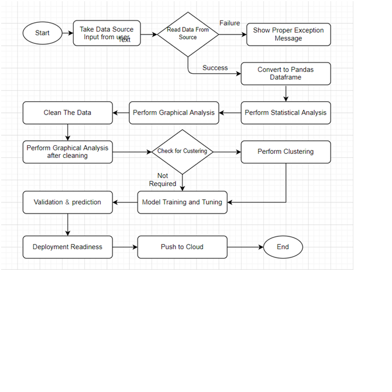

# _**Application Workflow**_

## Exception Scenarios 

Step	|Exception|	Mitigation|
----------|----|------|
User gives Wrong Data Source|	Give proper error message|	Ask the user to re-enter the details
User gives corrupted data |	Give proper error message|	
User gives wrong null symbol|	Give proper error message|	Ask the user to provide correct symbol used for missing values
If the cluster contains only one class	|No error message required	Handle this exception internally.| User doesn’t know.
Deployment credentials are wrong	|Give proper error message	|Ask for the details to be entered again
