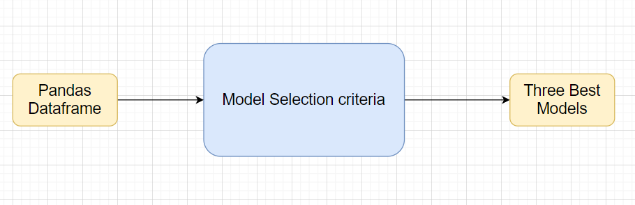
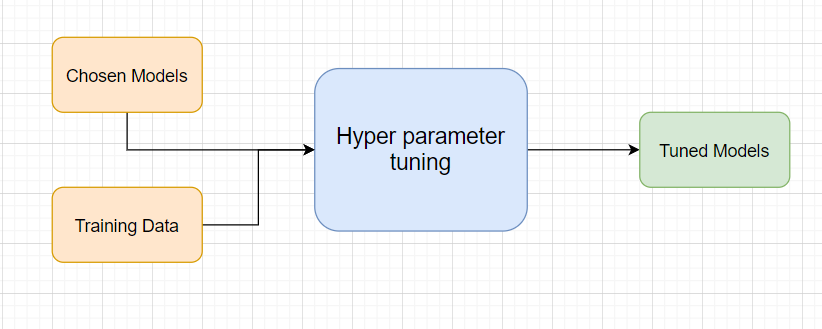
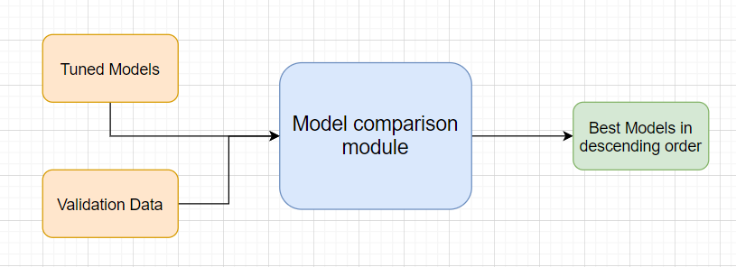

## Model Selection
Model selection is the process of selecting one final machine learning model from among a collection of candidate machine learning models for a training dataset.

It is a process that can be applied both across different types of models (e.g. logistic regression, SVM, KNN, etc.) and across models of the same type configured with different model hyperparameters (e.g. different kernels in an SVM).

|Step  |Exception |Mitigation|
--------|----------|----|
Wrong parameters passed to the methods|Handle Internally|Code should never give a wrong input|
       
## Model Tuning and Optimization

### Divide into train and test

The data should have been divided into train and validation set before this.
Methods for hyper tuning all kinds of models.

## Regression:

###Linear Regression

[Linear Regression](https://scikit-learn.org/stable/modules/generated/sklearn.linear_model.LinearRegression.html) is a linear approach to modeling the relationship between a scalar response (or dependent variable) and one or more explanatory variables (or independent variables).
KNN Regression Model

### Polinomial Regression
[Polynomial Regression](https://orange3-educational.readthedocs.io/en/latest/widgets/polynomial-regression.html) is a form of regression analysis in which the relationship between the independent variable x and the dependent variable y is modelled as an nth degree polynomial in x

## Model selection criteria:

### MSE 
The mean squared error [(MSE)](https://en.wikipedia.org/wiki/Mean_squared_error#:~:text=In%20statistics%2C%20the%20mean%20squared,values%20and%20the%20actual%20value.) or mean squared deviation (MSD) of an estimator (of a procedure for estimating an unobserved quantity) measures the average of the squares of the errors—that is, the average squared difference between the estimated values and the actual value.

### RMSE 
Root Mean Square Error [(RMSE)](https://www.statisticshowto.com/probability-and-statistics/regression-analysis/rmse-root-mean-square-error/#:~:text=Root%20Mean%20Square%20Error%20(RMSE)%20is%20the%20standard%20deviation%20of,the%20line%20of%20best%20fit.) is the standard deviation of the residuals (prediction errors). Residuals are a measure of how far from the regression line data points are; RMSE is a measure of how spread out these residuals are. In other words, it tells you how concentrated the data is around the line of best fit.

### R squared
[R-squared (R2)](https://www.google.com/url?sa=t&rct=j&q=&esrc=s&source=web&cd=&cad=rja&uact=8&ved=2ahUKEwiOxZmOqerqAhWRX30KHcB8CxEQFjAHegQIERAH&url=https%3A%2F%2Fwww.investopedia.com%2Fterms%2Fr%2Fr-squared.asp%23%3A~%3Atext%3DR%252Dsquared%2520(R2)%2Cvariables%2520in%2520a%2520regression%2520model.&usg=AOvVaw0XLIJ0P9bwm_7FLZZ030n1
) is a statistical measure that represents the proportion of the variance for a dependent variable that's explained by an independent variable or variables in a regression model.

### adjusted R squared
The adjusted R-squared is a modified version of R-squared that has been adjusted for the number of predictors in the model. The adjusted R-squared increases only if the new term improves the model more than would be expected by chance. It decreases when a predictor improves the model by less than expected by chance.

## Classification:
Classification is an important and popular machine learning tool that assigns items in a data set to different categories. Classification is used to predict risk over time, in fraud detection, text categorization, and more. Classification functions begin with a data set where the different categories are known. For example, suppose you want to classify students based on how likely they are to get into graduate school. In addition to factors like admission score exams and grades, you could also track work experience.

### Logistic Regression
[Logistic regression](generated/sklearn.linear_model.LogisticRegression.html
) is a statistical model that in its basic form uses a logistic function to model a binary dependent variable, although many more complex extensions exist. In regression analysis, logistic regression (or logit regression) is estimating the parameters of a logistic model (a form of binary regression).

### Decision Tree
A [decision tree](https://www.google.com/url?sa=t&rct=j&q=&esrc=s&source=web&cd=&cad=rja&uact=8&ved=2ahUKEwj5o5S7qurqAhUBOisKHaYzAEMQFjAIegQICBAB&url=http%3A%2F%2Fscikit-learn.org%2Fstable%2Fmodules%2Ftree.html&usg=AOvVaw0lSaFzDc1nnQhPpTXeI-LR) is a flowchart-like structure in which each internal node represents a “test” on an attribute (e.g. whether a coin flip comes up heads or tails), each branch represents the outcome of the test, and each leaf node represents a class label (decision taken after computing all attributes)

### Random Forest
[Random forests](https://en.wikipedia.org/wiki/Random_forest) or random decision forests are an ensemble learning method for classification, regression and other tasks that operate by constructing a multitude of decision trees at training time and outputting the class that is the mode of the classes (classification) or mean prediction (regression) of the individual trees.[1][2] Random decision forests correct for decision trees' habit of overfitting to their training set.[

### XG Boost
[XGBoost](https://www.google.com/url?sa=t&rct=j&q=&esrc=s&source=web&cd=&cad=rja&uact=8&ved=2ahUKEwiO5decq-rqAhVQSX0KHVi-As0QFjABegQIBRAB&url=https%3A%2F%2Fmachinelearningmastery.com%2Fdevelop-first-xgboost-model-python-scikit-learn%2F&usg=AOvVaw2efWvsLKN9bDxF0whZ38c5) is an implementation of gradient boosted decision trees designed for speed and performance that is dominative competitive machine learning.

### Support Vector Classifier
In machine learning, [support-vector machines](https://en.wikipedia.org/wiki/Support_vector_machine) (SVMs, also support-vector networks[1]) are supervised learning models with associated learning algorithms that analyze data used for classification and regression analysis. The Support Vector Machine (SVM) algorithm is a popular machine learning tool that offers solutions for both classification and regression problems.

### KNN Classifier
K-nearest neighbors (KNN) algorithm is a type of supervised ML algorithm which can be used for both classification as well as regression predictive problems. However, it is mainly used for classification predictive problems in industry. The following two properties would define KNN well −

Lazy learning algorithm − KNN is a lazy learning algorithm because it does not have a specialized training phase and uses all the data for training while classification.

Non-parametric learning algorithm − KNN is also a non-parametric learning algorithm because it doesn’t assume anything about the underlying data.

**Working of KNN Algorithm**

K-nearest neighbors (KNN) algorithm uses ‘feature similarity’ to predict the values of new datapoints which further means that the new data point will be assigned a value based on how closely it matches the points in the training set. We can understand its working with the help of following steps −

Step 1 − For implementing any algorithm, we need dataset. So during the first step of KNN, we must load the training as well as test data.

Step 2 − Next, we need to choose the value of K i.e. the nearest data points. K can be any integer.

Step 3 − For each point in the test data do the following −

3.1 − Calculate the distance between test data and each row of training data with the help of any of the method namely: Euclidean, Manhattan or Hamming distance. The most commonly used method to calculate distance is Euclidean.

3.2 − Now, based on the distance value, sort them in ascending order.

3.3 − Next, it will choose the top K rows from the sorted array.

3.4 − Now, it will assign a class to the test point based on most frequent class of these rows.

### Naïve Baye’s
[Naïve Bayes classifiers](https://scikit-learn.org/stable/modules/naive_bayes.html) are a family of simple "probabilistic classifiers" based on applying Bayes' theorem with strong (naïve) independence assumptions between the features. They are among the simplest Bayesian network models. But they could be coupled with Kernel density estimation and achieve higher accuracy levels.

Naïve Bayes classifiers are highly scalable, requiring a number of parameters linear in the number of variables (features/predictors) in a learning problem. Maximum-likelihood training can be done by evaluating a closed-form expression, which takes linear time, rather than by expensive iterative approximation as used for many other types of classifiers.

## Model selection criteria:

### Accuracy
Accuracy is one metric for evaluating classification models. Informally, accuracy is the fraction of predictions our model got right. Formally, accuracy has the following definition: Accuracy = Number of correct predictions Total number of predictions.

### AUC
AUC - ROC curve is a performance measurement for classification problem at various thresholds settings. ROC is a probability curve and AUC represents degree or measure of separability. It tells how much model is capable of distinguishing between classes. Higher the AUC, better the model is at predicting 0s as 0s and 1s as 1s.

### PrecisionRecall
Precision-Recall is a useful measure of success of prediction when the classes are very imbalanced. In information retrieval, precision is a measure of result relevancy, while recall is a measure of how many truly relevant results are returned.

The precision-recall curve shows the tradeoff between precision and recall for different threshold. A high area under the curve represents both high recall and high precision, where high precision relates to a low false positive rate, and high recall relates to a low false negative rate. High scores for both show that the classifier is returning accurate results (high precision), as well as returning a majority of all positive results (high recall).

A system with high recall but low precision returns many results, but most of its predicted labels are incorrect when compared to the training labels. A system with high precision but low recall is just the opposite, returning very few results, but most of its predicted labels are correct when compared to the training labels. An ideal system with high precision and high recall will return many results, with all results labeled correctly.

### F1 Score
F1 Score combines Recall and Precision to one performance metric. F1 Score is the weighted average of Precision and Recall. Therefore, this score takes both false positives and false negatives into account. F1 is usually more useful than Accuracy, especially if you have an uneven class distribution.

## Clustering:
[Clustering](https://www.google.com/url?sa=t&rct=j&q=&esrc=s&source=web&cd=&cad=rja&uact=8&ved=2ahUKEwje2rTnx-rqAhVYfH0KHfFeAUAQFjAAegQIBRAB&url=http%3A%2F%2Fscikit-learn.org%2Fstable%2Fmodules%2Fclustering.html&usg=AOvVaw2_1t0O6mddrfFKCpdkNTpr) is a Machine Learning technique that involves the grouping of data points. Given a set of data points, we can use a clustering algorithm to classify each data point into a specific group. In theory, data points that are in the same group should have similar properties and/or features, while data points in different groups should have highly dissimilar properties and/or features. Clustering is a method of unsupervised learning and is a common technique for statistical data analysis used in many fields.

### K-Means
[k-means clustering](https://scikit-learn.org/stable/modules/generated/sklearn.cluster.KMeans.html) is a method of vector quantization, originally from signal processing, that aims to partition n observations into k clusters in which each observation belongs to the cluster with the nearest mean, serving as a prototype of the cluster.
### Hierarchial
[Hierarchical clustering](https://www.google.com/url?sa=t&rct=j&q=&esrc=s&source=web&cd=&cad=rja&uact=8&ved=2ahUKEwiYycr8wurqAhWKb30KHZljBVMQFjAHegQIERAG&url=https%3A%2F%2Fwww.displayr.com%2Fwhat-is-hierarchical-clustering%2F%23%3A~%3Atext%3DHierarchical%2520clustering%252C%2520also%2520known%2520as%2Cbroadly%2520similar%2520to%2520each%2520other.&usg=AOvVaw1kFR6cJki3xeeNC13EERxk), also known as hierarchical cluster analysis, is an algorithm that groups similar objects into groups called clusters. The endpoint is a set of clusters, where each cluster is distinct from each other cluster, and the objects within each cluster are broadly similar to each other.
### DBSCAN
K-Means clustering may cluster loosely related observations together. Every observation becomes a part of some cluster eventually, even if the observations are scattered far away in the vector space. Since clusters depend on the mean value of cluster elements, each data point plays a role in forming the clusters. A slight change in data points might affect the clustering outcome. This problem is greatly reduced in [DBSCAN](https://scikit-learn.org/stable/modules/generated/sklearn.cluster.DBSCAN.html) due to the way clusters are formed. This is usually not a big problem unless we come across some odd shape data.

What’s nice about DBSCAN is that you don’t have to specify the number of clusters to use it. All you need is a function to calculate the distance between values and some guidance for what amount of distance is considered “close”. DBSCAN also produces more reasonable results than k-means across a variety of different distributions

Class Name |ModelTuner    | |
----|---|---|  
|Method Name    |get_tuned_knn_model||    
| |Method Description  |This method will be used to get the hypertuned KNN Model
| |Input parameter  names  |self,data
| |Input Parameter Description |Data: the training data Hyperparameters to tune   
| |ouptput|    A hyper parameter tuned model object
| |On Exception    |Write the exception in the log file. Raise an exception with the appropriate error message

Exceptions |Scenarios| Module Wise|
-----|-----|----|
Step   |Exception |Mitigation
| | |
      

