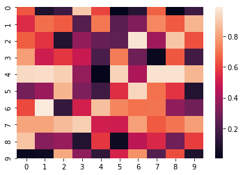

Once the pandas dataframe is given, using data visualization methods we will get corresponding data in the form of graph.

## Correlation Heatmaps

## Check for balance/imbalance

## Data Visualisation 
Class Name |DataVisualization ||
------|---------|----| 
Method Name    |read_data_from_csv    |
| |Method Description| This method will be used to read data from a csv file or a flat file
| |Input parameter  names| self,file_name, header,names, use_cols, separator
| |Input Parameter Description|    file_name: name of the file to be read header: Row number(s) to be used as column names names : array-like, optional List of column names to use. If file contains no header row, then you should explicitly pass ``header=None``. Use_cols:  To load a subset of columns Separator: Delimiter to use
| |    output |A pandas Dataframe
| |On Exception|   Write the exception in the log file. Raise an exception with the appropriate error message

## Exceptions Scenarios Module Wise

Step   |Exception|    Mitigation|
|------|------|---------|
Wrong input to the methods |   Handle Internally| Code should never give a wrong input

## Technical solution 

## OLS
 Ordinary least squares
The OLS method corresponds to minimizing the sum of square differences between the observed and predicted values.

## VIF

The variance inflation factor (VIF) is the quotient of the variance in a model with multiple terms by the variance of a model with one term alone. It quantifies the severity of multicollinearity in an ordinary least squares regression analysis.
Correlation:
Correlation is a statistical technique that can show whether and how strongly pairs of variables are related

## Silhouette Coefficient

Silhouette Coefficient or silhouette score is a metric used to calculate the goodness of a clustering technique. Its value ranges from -1 to 1.
1: Means clusters are well apart from each other and clearly distinguished.
0: Means clusters are indifferent, or we can say that the distance between clusters is not significant.
-1: Means clusters are assigned in the wrong way.

 
## Exceptions Scenarios 

Step   |Exception |Mitigation|
-----|-----|------|
Column has mixed values(Integer & number)  |Give proper error message |Ask the user to correct the data.
Not all values are numbers |   Handle Internally  |Convert categorical to numerical values

## Seasonality:
Seasonality is a characteristic of a time series in which the data experiences regular and predictable changes that recur every calendar year. Any predictable fluctuation or pattern that recurs or repeats over a one-year period is said to be seasonal.

## Stationary Data:
A common assumption in many time series techniques is that the data are stationary. A stationary process has the property that the mean, variance and autocorrelation structure do not change over time

