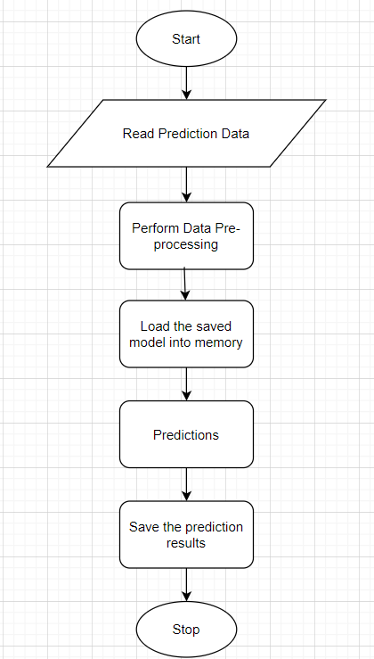

#  **_Testing Modules_**

 It Divide the training data itself into  train and test sets Use test data to have tests run on the three best models Give the test report_:
    
    
     - R2 Score
     - Adjusted R2 score
     - MSE
     - Accuracy
     - Precision
     - Recall
     - F Beta
     - Cluster Purity
     - Silhouette score 

 Step   |Exception |Mitigation|
 --------|------|----------|
 Number of Parameters do not match  | Handle internally |Check the test data creation and verify the  columns
 Only once class present in test data   |Handle Internally| |
