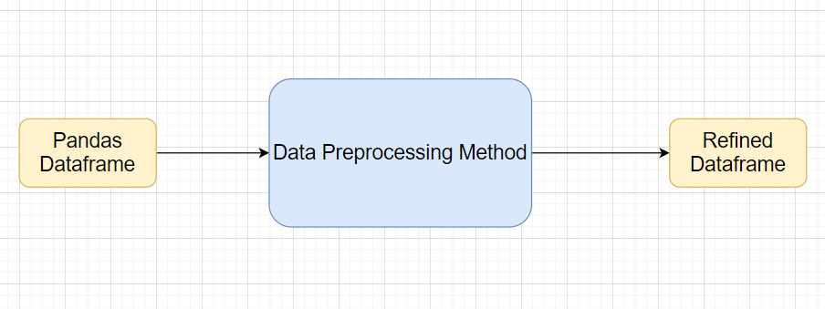

## Transformations
### Imputing missing values

* Method Name: impute_missing_values
* Description: This method will be used to impute missing values in the dataframe

### Categorical to numerical
* Method Name: type_conversion
* Description: This method will be used to convert column datatype from numerical to categorical or vice-versa, if possible.

### Imbalanced data set handling
* Method Name: remove_imbalance
* Description: This method will be used to handle unbalanced datasets(rare classes) through oversampling/ undersampling techniques

### Handling columns with std deviation zero or below a threshold
* Method Name: standardize_data
* Description: This method will be used to standardize al the numeric variables. Where mean = 0, std dev = 1.

### Normalisation
* Method Name: normalize_data
* Description: This method will be used to normalize all the numeric variables. Where min value = 0 and max value = 1.
        
### PCA
* Method Name: pca
* Description: This method reduces the dimension from scaled Data which enables quick for large data files.

## Data Preprocessor

Class Name |DataPreprocessor| |
----|-------|--------|    
|Method Name    |impute_missing_values ||
| |Method Description  |This method will be used to read data from a csv file or a flat file. 
| |Input parameter  names| self,file_name, header,names, use_cols, separator.
| |Input Parameter Description	|file_name: name of the file to be read. 
| | |header: Row number(s) to be used as column names
| | |names : array-like, optional
   | | |List of column names to use. If file contains no header row, then you should explicitly pass ``header=None``.
| | |Use_cols:  To load a subset of columns
| | |Separator: Delimiter to use
| |Output| A pandas Dataframe
| |On Exception|   Write the exception in the log file. Raise an exception with the appropriate error message

## Exceptions Scenarios Module Wise

Step|  Exception| Mitigation|
---|---|----|
Wrong parameters passed to the methods |   Handle Internally  |Code should never give a wrong input

