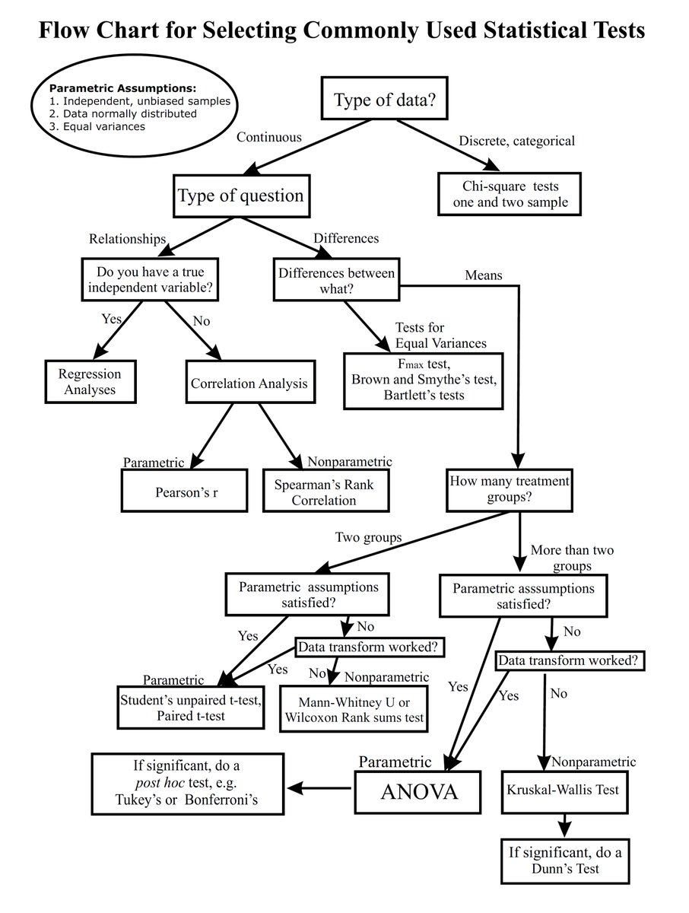

## Technical solution 

## OLS
 Ordinary least squares
The OLS method corresponds to minimizing the sum of square differences between the observed and predicted values.
## VIF

The variance inflation factor (VIF) is the quotient of the variance in a model with multiple terms by the variance of a model with one term alone. It quantifies the severity of multicollinearity in an ordinary least squares regression analysis.
Correlation:
Correlation is a statistical technique that can show whether and how strongly pairs of variables are related

## Anova test

An ANOVA test is a way to find out if survey or experiment results are significant. In other words, they help you to figure out if you need to reject the null hypothesis or accept the alternate hypothesis. Basically, you're testing groups to see if there's a difference between them.
## Chi-square test

Pearson's chi-square test is used to determine whether there is a statistically significant difference between the expected frequencies and the observed frequencies in one or more categories of a contingency table.
## Z-test

A z-test is a statistical test to determine whether two population means are different when the variances are known and the sample size is large. It can be used to test hypotheses in which the z-test follows a normal distribution. A z-statistic, or z-score, is a number representing the result from the z-test.
## T test

The t test is one type of inferential statistics. It is used to determine whether there is a significant difference between the means of two groups. With all inferential statistics, we assume the dependent variable fits a normal distribution
## Weight of evidence

The weight of evidence tells the predictive power of an independent variable in relation to the dependent variable.
## F-test

An F-test is any statistical test in which the test statistic has an F-distribution under the null hypothesis. It is most often used when comparing statistical models that have been fitted to a data set, in order to identify the model that best fits the population from which the data were sampled.
         

 
## Exceptions Scenarios 

Step   |Exception |Mitigation|
-----|-----|------|
Column has mixed values(Integer & number)  |Give proper error message |Ask the user to correct the data.
Not all values are numbers |   Handle Internally  |Convert categorical to numerical values

## Seasonality:
Seasonality is a characteristic of a time series in which the data experiences regular and predictable changes that recur every calendar year. Any predictable fluctuation or pattern that recurs or repeats over a one-year period is said to be seasonal.

## Stationary Data:
A common assumption in many time series techniques is that the data are stationary. A stationary process has the property that the mean, variance and autocorrelation structure do not change over time

