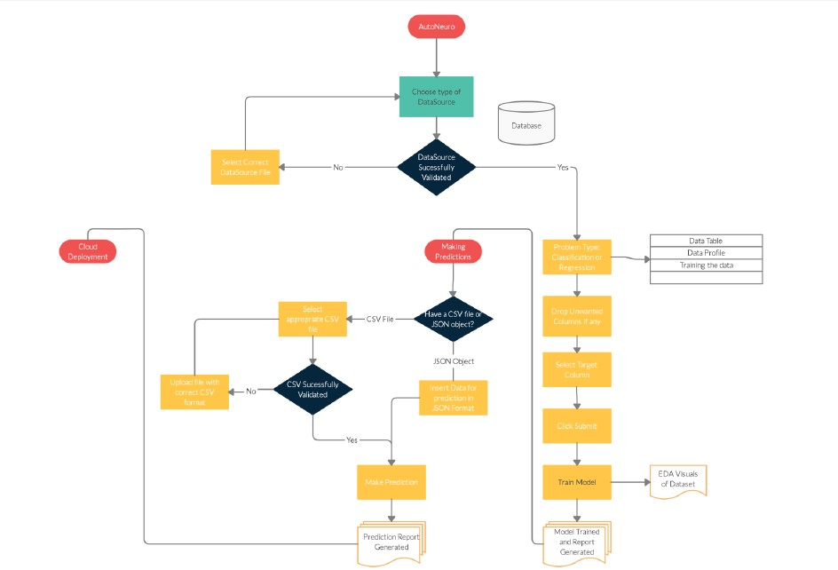

# **_Getting Started_**

## Welcome to AutoNeuro

AutoNeuro is an automated machine learning application built using python 3.7. It allows users to build production ready ML models with ease and efficiency. The project was started in 2020 as an internship project build in iNeuron.ai. It is an end to end automated machine learning solution where the user will only give dataset in recognizable formats and select the type of the problem and the result will be the best performing hyper tuned machine learning model. The descriptive and graphical analysis of the data is also displayed. The user will also get privileges to choose the deployment option. (eg: AWS, GCP).

##  Features 

•	Data sets automatically analyzed

•	Machine learning Modelling techniques using both classification and Regression

•	Extensive APIs to integrate AutoNeuro into your own tools and scripts

•	Evaluations of the models  for easy comparison and reuse

•	Automated model building based on the type of problem.

•	Output model is hyper-parameter tuned model 

•	Choice based automated deployment to various clouds.

•	Provision of user friendly interface to select input and target features 

