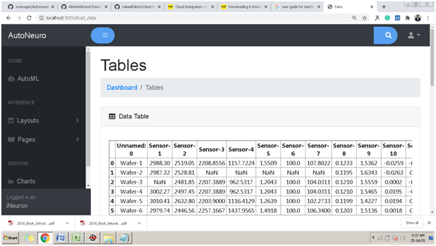
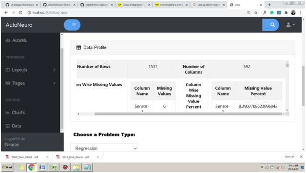
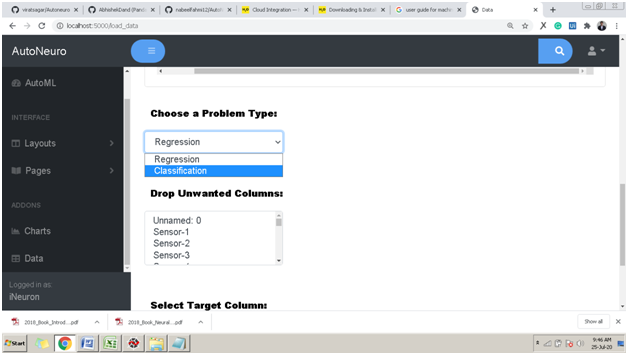
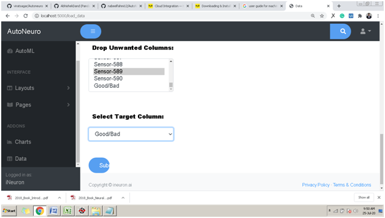

# How to Get AutoNeuro?


!!! Hardware Requirements

    === "Requirements for model training"

        _Suggested Requirment_:

        
        - 8 GB RAM
        - 4 GB of Hard Disk Space
        - Intel Core i7 Processor
        

        _Minimum Requirment_:

        - 4 GB RAM
        - 2 GB of Hard Disk Space
        - Intel Core i7 Processor

    === "Requirements for model testing"

        _suggested Requirment_:

        - 8 GB RAM
        - 4 GB of Hard Disk Space
        - Intel Core i7 Processor

        _Minimum Requirment_:

        - 4 GB RAM
        - 2 GB of Hard Disk Space
        - Intel Core i5 Processor
        
## Installation
```python
pip install autoneuro
```        
        
##Getting HomeScreen for AutoNeuro
"" here we will explain what code user has to write to start the process. For now I have written steps for running app.py""

If you have successfully installed AutoNeuro then:

- Go to application\app.py and run
- Open your web browser and go to localhost:5000


On Successful execution of steps you will see this screen.

##Adding Data Set for Training

To add training dataset:

- Click on Choose a data sources drop down:


- Select the type of the file you are uploading. You can upload CSV, Excel, HTML or Text files.
- Click on Choose file and select your training dataset file. Once you select the dataset it will be validated and on successful validation you would be able to upload data for training. 


- On clicking upload your data will be uploaded and you will be land to the following page.



- On this page you will be able to view detailed analysis of your training data. You will get information regarding missing values, columns with zero std deviation and if there is any duplicate column.



- If you have reached this page then you have successfully loaded the data for training. Now it’s time to train the data.

##Training the data

- After successfully uploading the data go to “Choose a Problem Type” drop down and select the type of your Problem. You can select from Regression and Classification. AutoNeuro will automatically perform feature engineering and train your data with the highest optimization.



- After selecting problem type, if you want to drop any unwanted columns then you can select that from the “Drop Unwanted Columns”. After dropping, the final step is to select the Target Column (dependent column which you want to predict) and click “Submit”.


        