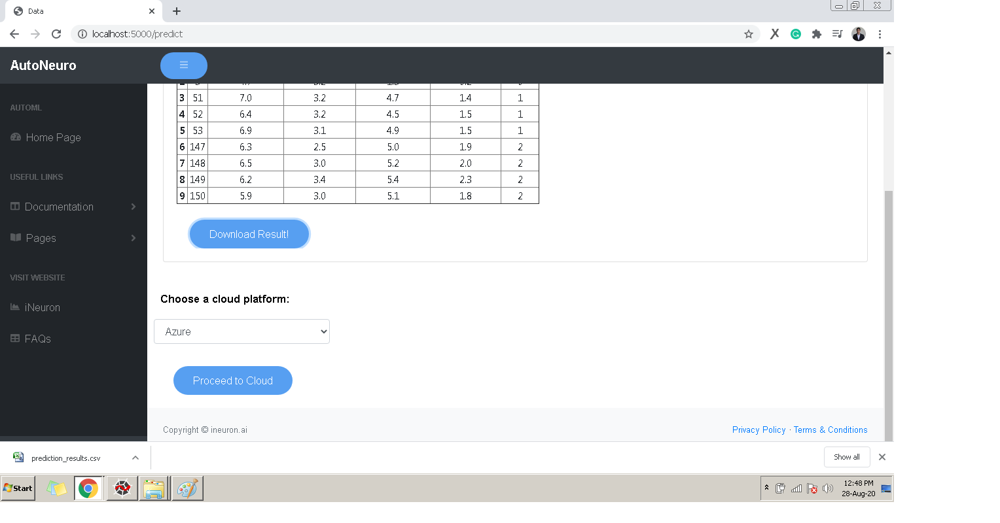
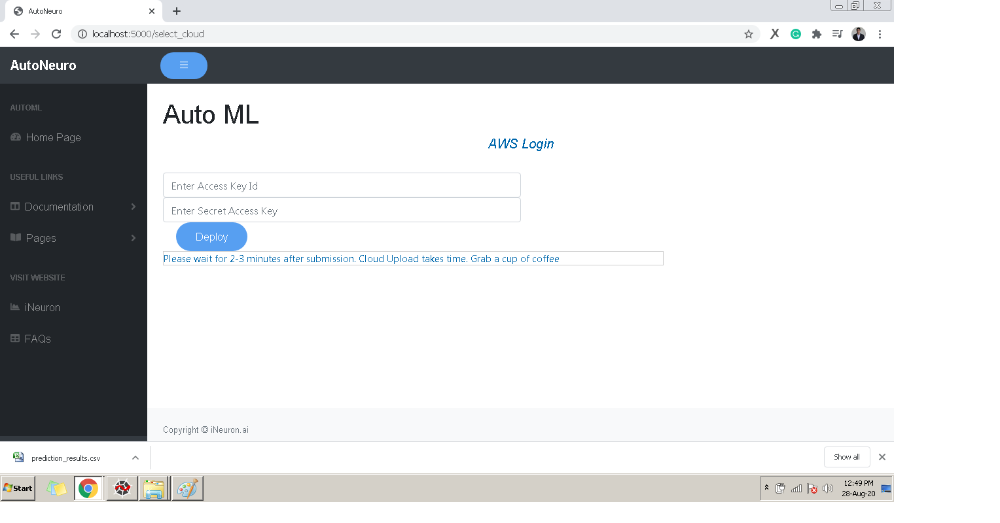

# **_Deploying Model to Cloud_**

- Once you are satisfied with the model Select the cloud Service in which you want to deploy model. We offer deployment in Azure, GCP, AWS.

- Select the Cloud Service in which you want to deploy and Click Proceed to Cloud.

## Deployment in AWS
- Enter the Access KeyId and Secret Access Key of your AWS account and click Deploy.

