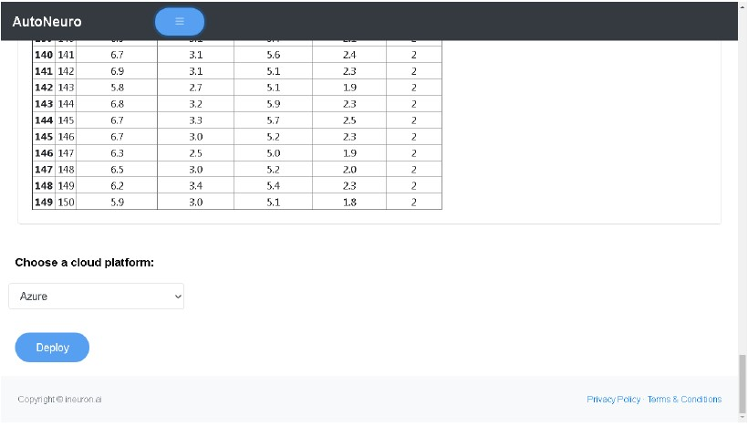

# Deploying Model to Cloud
* Once you are satisfied with the model Select the cloud Service in which you want to deploy model. We offer deployment in Azure, GCP, AWS.
* Click on Deploy to proceed further.

