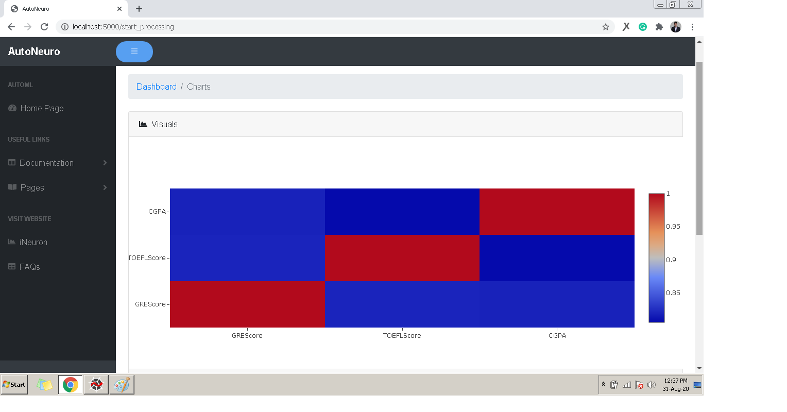
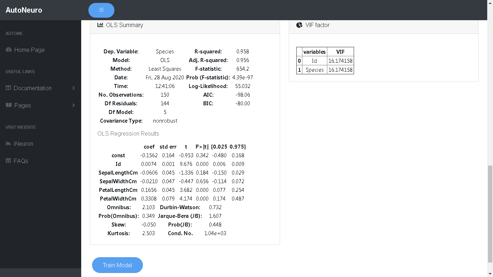

# **_Data Visualization_**
Data visualization is the graphical representation of information and data. 
By using visual elements like charts, graphs, and maps, data visualization tools provide an accessible way to see and understand trends, outliers, and patterns in data.

You will see various charts and graphs to understand your data well.

## Correlation matrix heatmaps
 

## Balance/Imbalance in the dataset 

## OLS Summary & VIF statistics

