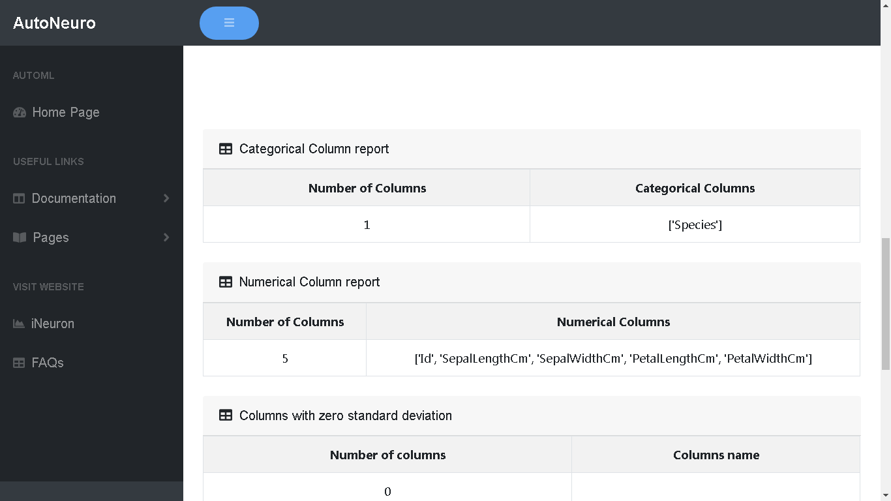
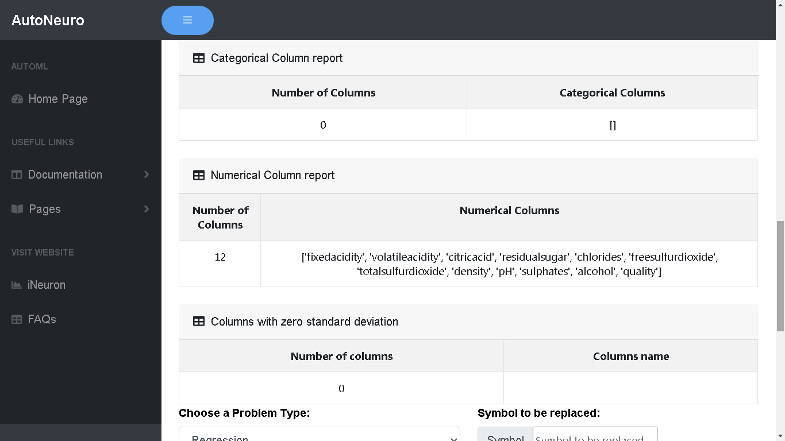
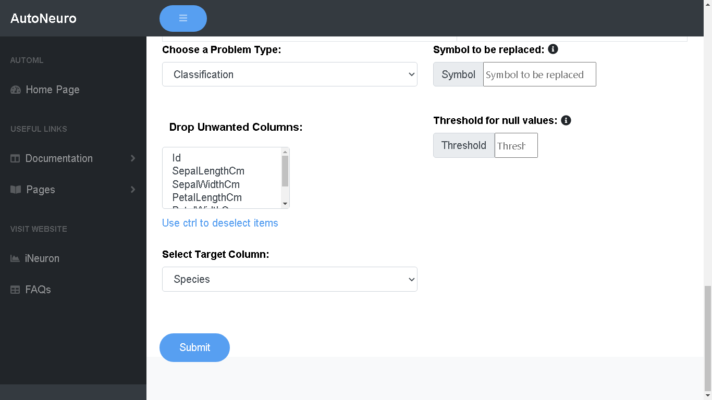
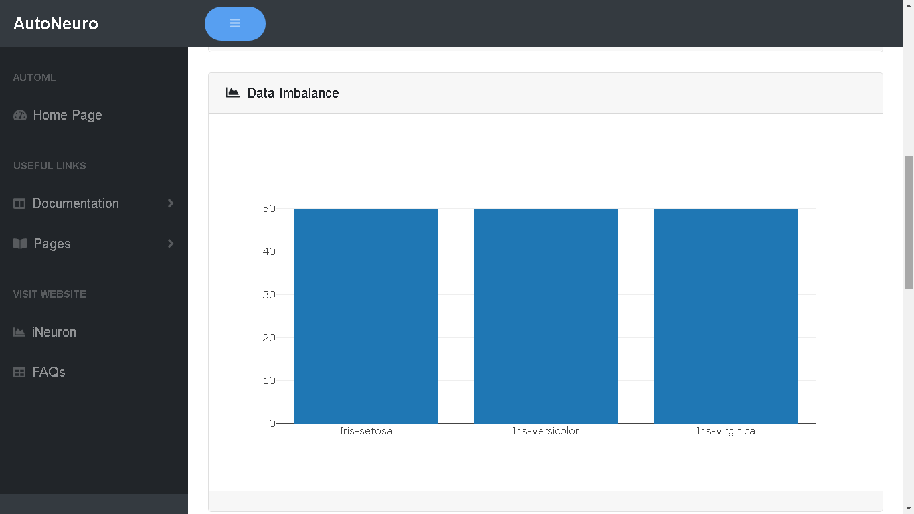
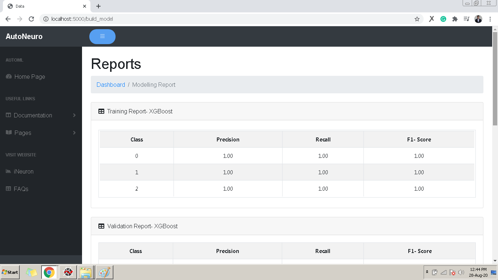

# **_Model Training_**

- On this page you will be able to view detailed analysis of your training data. You will get information regarding missing values, columns with zero std deviation and if there is any duplicate column.

- If you have reached this page then you have successfully loaded the data for training. Now it’s time to train the data.

##Training the data

- After successfully uploading the data go to “Choose a Problem Type” drop down and select the type of your Problem. You can select from Regression and Classification. AutoNeuro will automatically perform feature engineering and train your data with the highest optimization.

- After selecting problem type, if you want to drop any unwanted columns then you can select that from the “Drop Unwanted Columns”. After dropping, the final step is to select the Target Column (dependent column which you want to predict) and click “Submit”.

