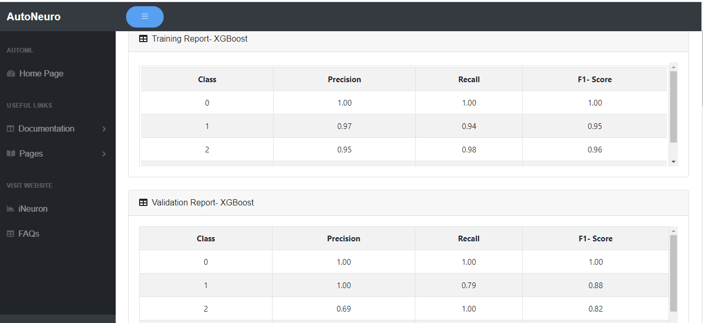
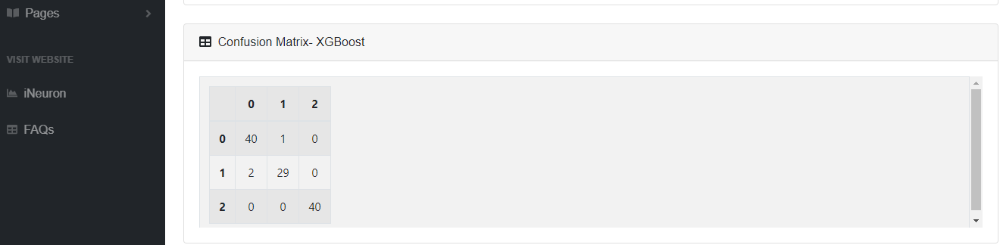
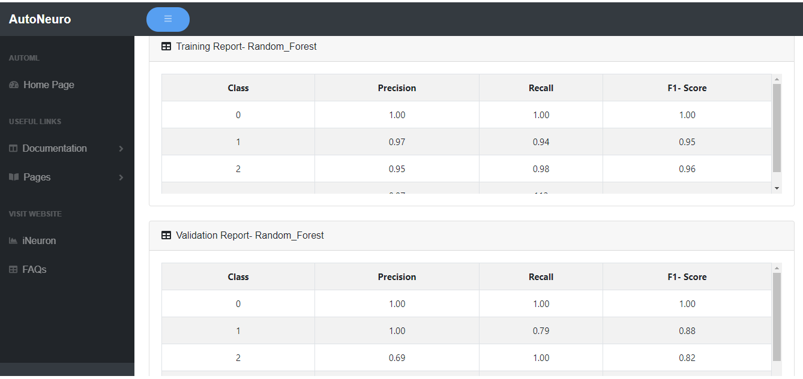
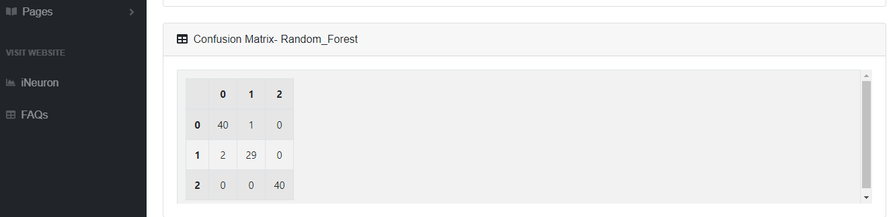
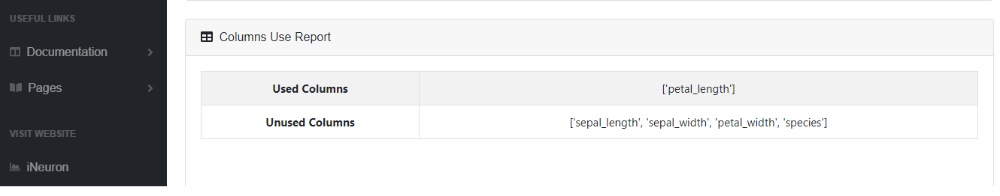

# **_Model Training_**

AutoNeuro will train the models with different hyper parameters and generate report for the best model. 
If the data is trained successfully then you will be able to see reports.

##Training the data

- select problem type from **Choose a problem type** dropdown (Regression/Classification)

- select unwanted columns to be dropped from **Drop Unwanted Columns** dropdown (all the columns from your dataset will be listed here)

- select the target Column (dependent column which you want to predict) from **Select Target Column** dropdown.(all the columns from your dataset will be listed here)

- enter the **Symbol to be replaced** to replace the null values in the dataset.

- enter the **Threshold for null values** (ffor the columns with null values)

Once the model is trained , the reports will be displayed as given below:

##Reports

###XGBoost Model
 

###Random Forest Model

###Column Usage

