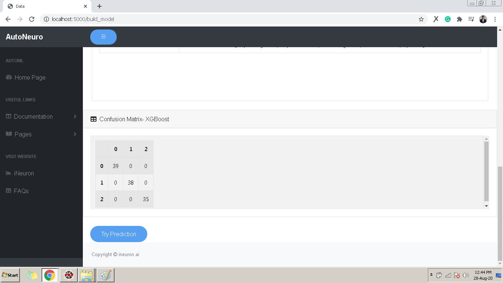
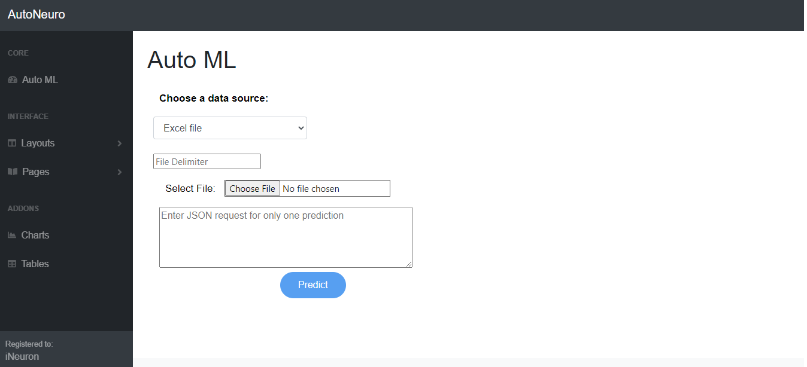
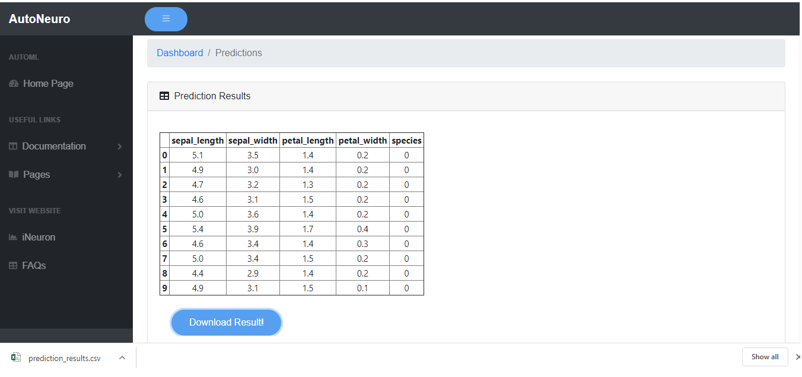

# **_Predictions_**

- Once you have successfully trained the model you will be able to make predictions.
 
- Use **Try Prediction** button at the bottom of the report for making Predictions.

##Try Prediction

You will be redirected to the following page

To upload file for prediction:
- **"Choose a data source"** 

- **"Choose File"**  to upload 

- Press **“Predict”** to generate Prediction Report.

##Prediction Report
- The prediction result will be displayed as below.

- There is also a provision to download this report using **Download Result**

To predict single record :

- Enter the data in JSON format

- Press **“Predict”** to generate Prediction Report.

 

