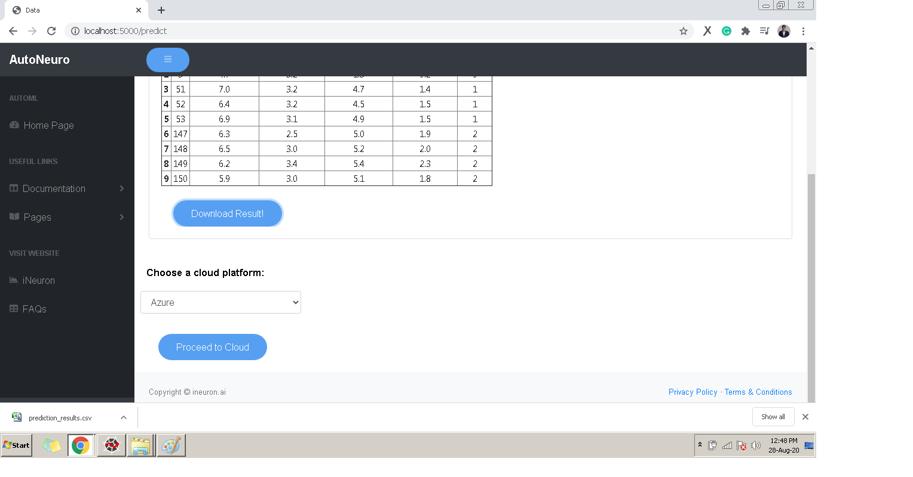

# **_Predictions_**

- Once you have successfully trained the data you will be able to make predictions. Press ‘Try Prediction’ button at the bottom of the report for making Predictions.

- For making prediction select the type of testing datafile.
- Select the test file using “Choose File”.

- Press “Predict” to generate Prediction Report.

