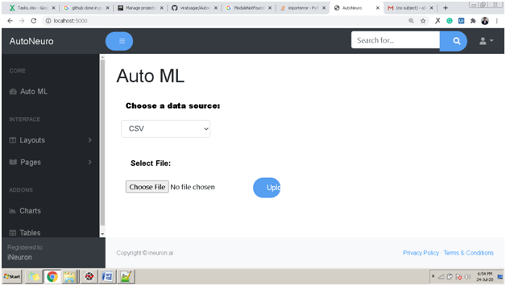
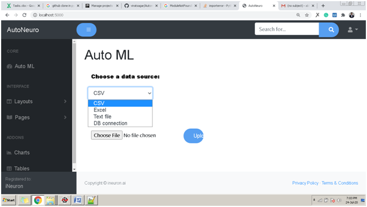
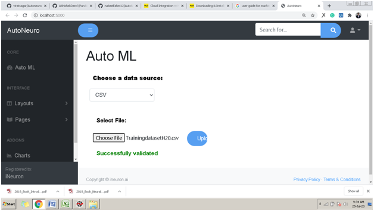

# Uploading Data

The process for Uploading Data Are as follows:

## Getting HomeScreen for AutoNeuro

!!! Note

     _Here we will explain what code user has to write to start the process. For now I have written steps for running app.py_

If you have successfully installed AutoNeuro then:

- Go to application\app.py and run
- Open your web browser and go to localhost:5000

On Successful execution of steps you will see this screen.

##Adding Data Set for Training

To add training dataset:

- Click on Choose a data sources drop down:

- Select the type of the file you are uploading. You can upload CSV, Excel, HTML or Text files.
- Click on Choose file and select your training dataset file. Once you select the dataset it will be validated and on successful validation you would be able to upload data for training. 

- On clicking upload your data will be uploaded and you will be land to the following page.
