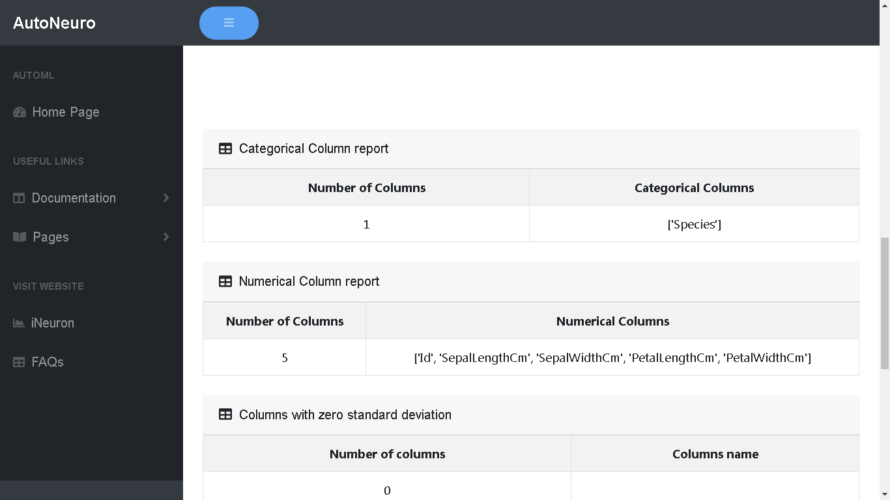
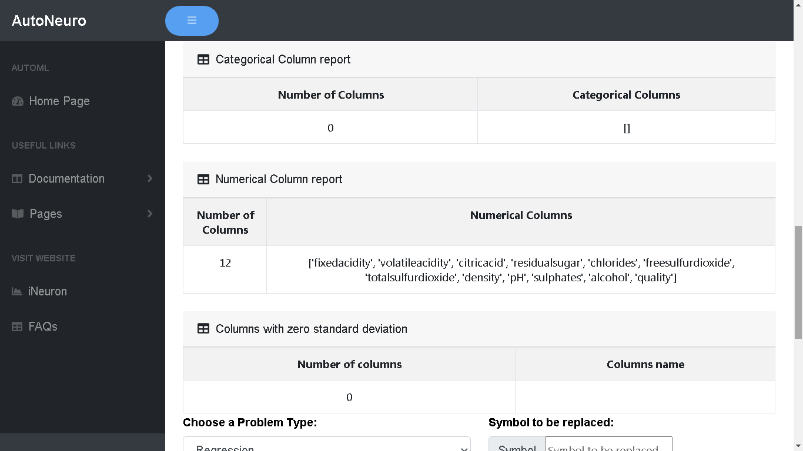

# **_Uploading Data_**

The process for uploading data is as follows:

## Getting HomeScreen for AutoNeuro

!!! Note

     _Here we will explain what code user has to write to start the process. For now I have written steps for running app.py_

If you have successfully installed AutoNeuro then:

- Go to application\app.py and run
- Open your web browser and go to localhost:5000

On Successful execution of steps you will see this screen.

##Adding a Data Set for Training

To add training dataset:

- Click on **Choose a data source** drop down:

- Select the type of the file you are uploading using **Choose a data soure** dropdown
  You can upload CSV, Excel, HTML ,JSON or Text files
- Select the databse type using **Choose a database type** dropdown
- Enter file delimiter in the space provided
- Click on **Choose file** and select your training dataset file. Once you select the dataset it will be validated and on successful validation you would be able to upload data for training. 

- On clicking **Upload** button,  your data will be uploaded and you will be redirected  to the data profile.

##Data Profile

Here you will be able to view detailed analysis of your training data.

* First 10 records
* No of rows and columns
* duplicate rows
* data size
* missing value information
* categorical & numerical columns
* columns with zero standard deviation

