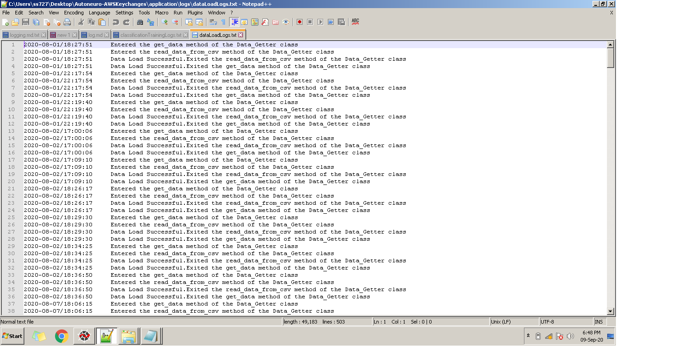
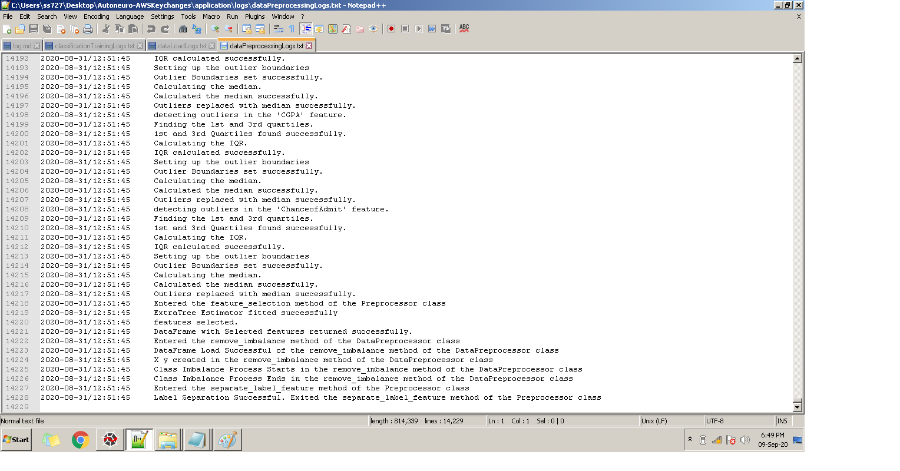
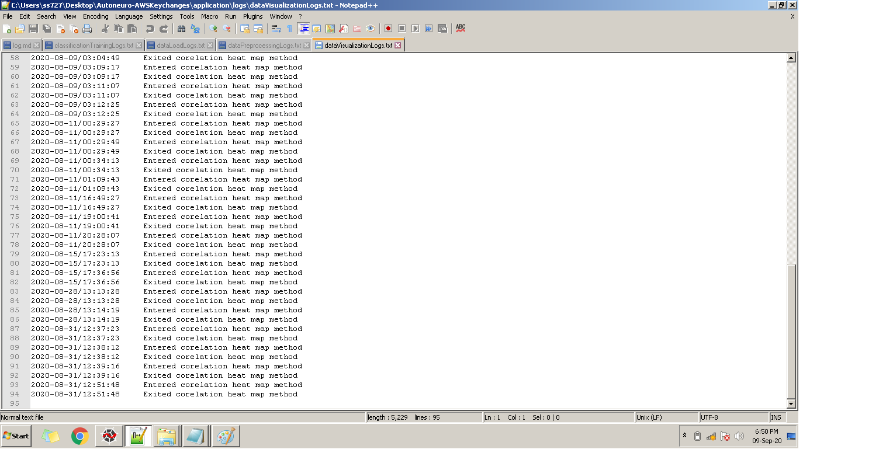
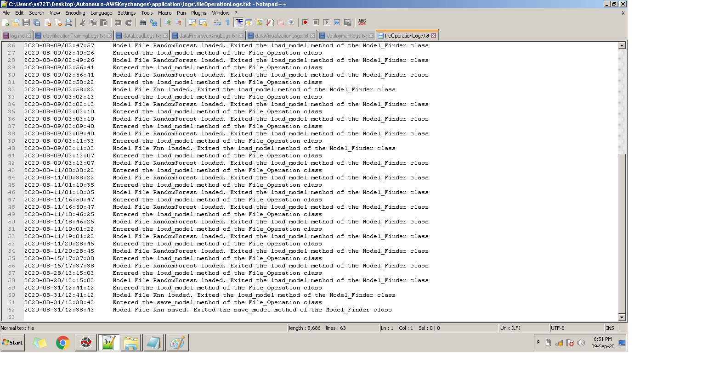
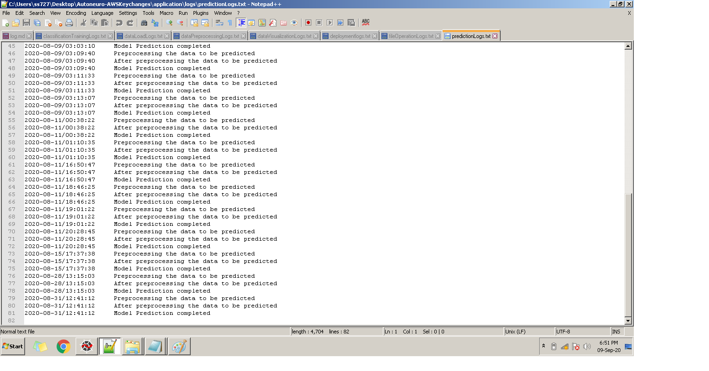
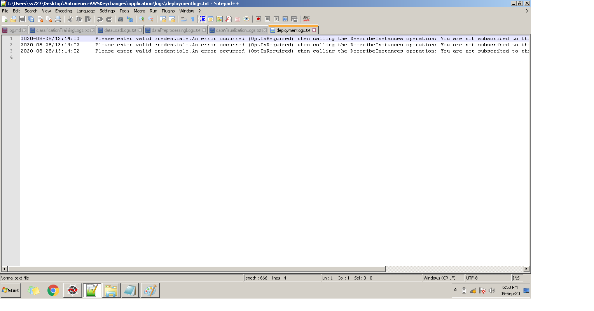

# AutoNeuro User Guide

## Logging

- AutoNeuro logs each and every step it performs. If it fails for some reason then you can read the logs and resolve it. 
- We have seven log files which stores at which step the error occured.- 
- In the respective Log files you will find the datetime stamp and descritption.
- Description will tell us the location of the exception
- Description will also include the cause to help in resolution
## Log files

### dataLoadLogs
- You will find all the dataload realted logs

### dataPreprocessingLogs

- All the dataPreprocessingLogs are saved inside dataPreprocessingLogs.txt.

### dataVisualizationLogs

- Logs realted to data Visualization will be stored inside this file.

### classificationTrainingLogs

- Logging while training the model will be done in this file.

### fileOperationLogs

- All the file realted operations like read, write, append and update are logged here and you can find where the updation is occured.

### PredictionLogs

- PredictionLogs will save all the prediction realted logs.

### DeploymentLogs

- Logging of deployment is done in deploymentLogs file.

